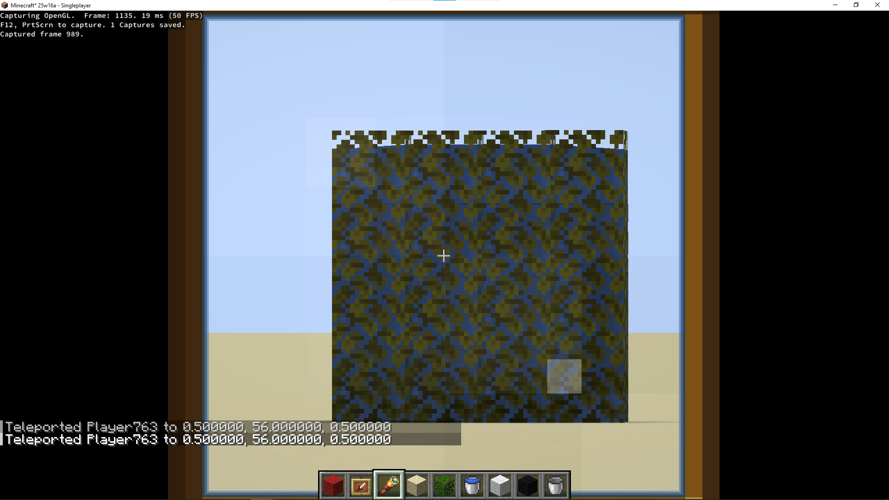
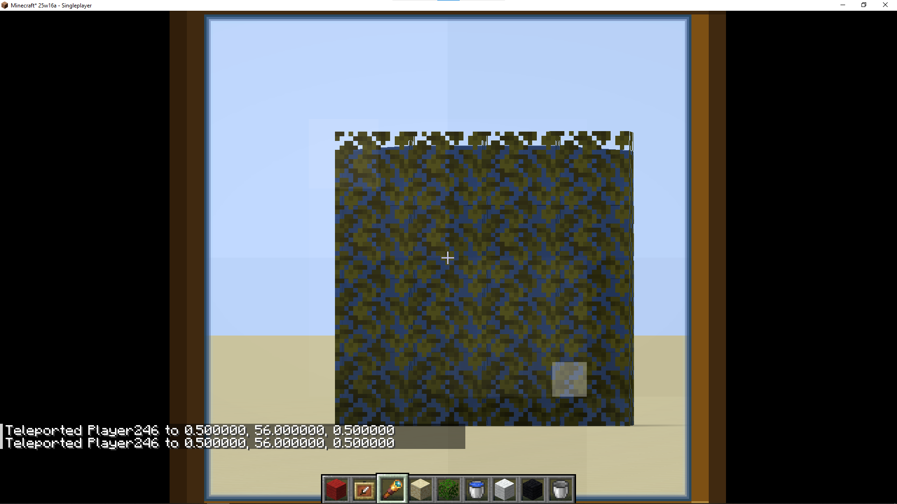
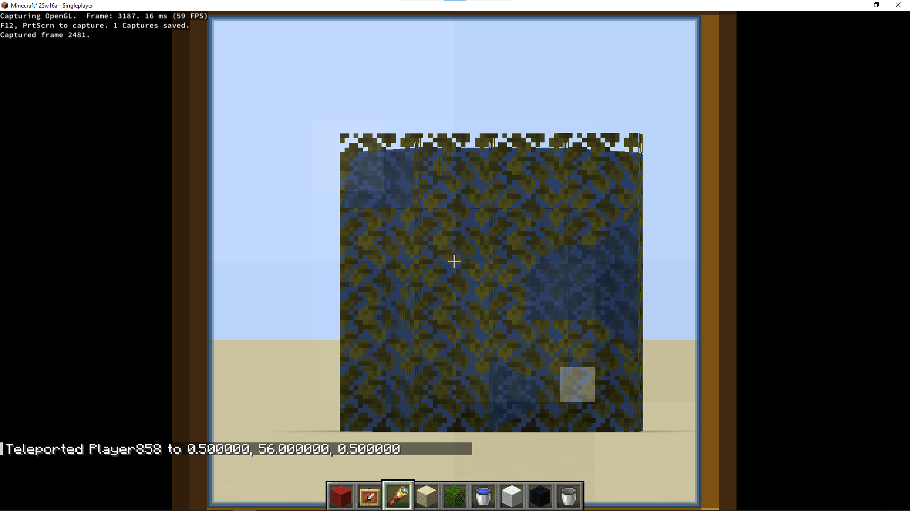
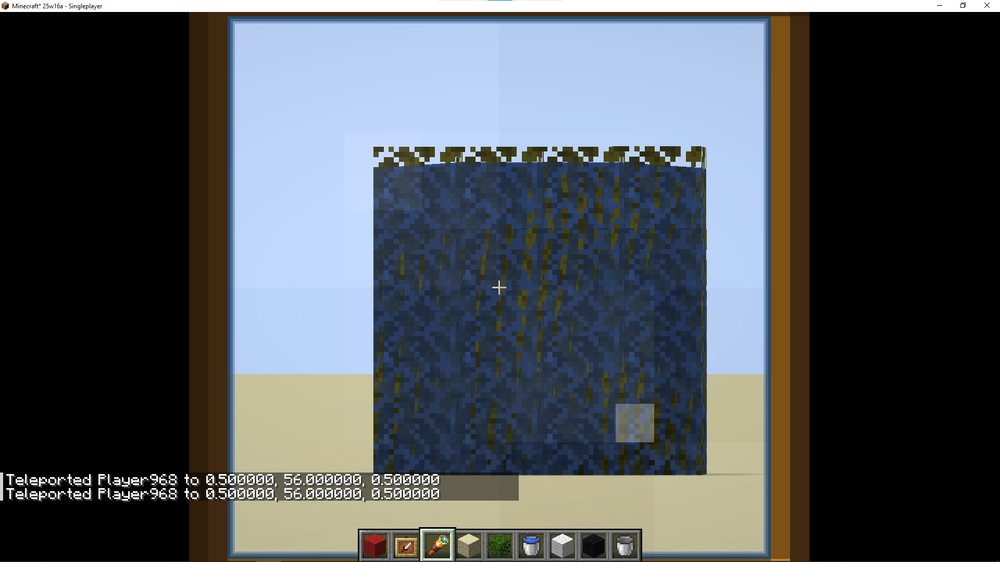

## Reversed Z infinite Projection Matrix

This is a proof of concept of implementing a reversed z projection matrix,
optionally with an infinite far plane. This also changes the depth buffer format from D32 to D32F.

The fabulous graphics mod has been modified to work with rev-z, as such it doesn't it's now broken in vanilla.

To choose which mode is used supply the `farz.mode` JVM argument as:
- `-Dfarz.mode=infinite` for reversed z with an infinite far z
- `-Dfarz.mode=reverse` for reversed z
- `-Dfarz.mode=vanilla` for vanilla

Note: View Bobbing and Nausea won't work correctly because I'm lazy, see `FrustumMixin`

For demonstration purposes I've also removed all fog.

To see the differences for yourself I recommend using waterlogged leaves at ~128 blocks and looking at them through a spyglass.
With vanilla rendering there is obvious z-fighting, with rev-z and inf-z there isn't any.

## Implementation

The implementation in this mod is quite hacky, as it is just a PoC, but a proper implementation woudn't be much different.

These are te changes:

- Uses of `GL_DEPTH_COMPONENT32` have been replaced with `GL_DEPTH_COMPONENT32F`
- The depth clip range is changed from `GL_NEGATIVE_ONE_TO_ONE` to `GL_ZERO_TO_ONE` with `glClipControl(GL45.GL_LOWER_LEFT, GL45.GL_ZERO_TO_ONE)`
- Orthographic and perspective projection matrices have been adjusted for the zero to one range
- The orthographic projection matrix's near and far z value have been swapped/reversed
- All calls to `glClearDepth` have their depth parameter reversed
- All calls to `glDepthFunc` have their comparison parameter reversed
- `transparency.fsh` has been adjusted to use `1.0 - depth` for all depth values.

This PoC shows that the change from normal to reversed Z is relatively simple.
But the result is a big improvement to z-fighting.

Further more using an infinite far plane actually improves depth precision even further,
and has the obvious added benefit of no far z clipping.

## Limitations

The use of reversed Z is only really sensible when a floating point depth buffer is used and the clip depth range is zero to one.
To change the depth range `glClipControl` is required. It was added by OpenGL 4.5 but is available with the extension [ARB_clip_control](https://registry.khronos.org/OpenGL/extensions/ARB/ARB_clip_control.txt).
The availability is sadly still limited, [opengl.gpuinfo.org](https://opengl.gpuinfo.org/listextensions.php) reports a 72.1% coverage.

However, there are two very obvious, simply fallbacks for systems that do not support it:

1. Use the -1 to 1 depth range, reverse z, and a fixed point depth buffer, with the same depth distribution as vanilla
2. Use the -1 to 1 depth range, reverse z, and a floating point depth buffer, with suboptimal precision distribution

Set `farz.fallback` to any value to disable zero-to-one depth and the floating point depth buffer, but keep reverse z.

## References

https://developer.nvidia.com/blog/visualizing-depth-precision/

https://iolite-engine.com/blog_posts/reverse_z_cheatsheet

https://tomhultonharrop.com/mathematics/graphics/2023/08/06/reverse-z.html

https://www.terathon.com/gdc07_lengyel.pdf

Sodium also thought about implementing reverse-z, but decided against it because of mod compatibility. This is part of the reason why it would be good to have in the base game.

https://github.com/CaffeineMC/sodium/issues/2324

## Comparison

Waterlogged leaves at a distance of 128 blocks

### Vanilla

## Reverse Z

## Reverse Z w/ infinite far z

## Reverse Z w/ glClipControl fallback and D32F

## Reverse Z w/ glClipControl fallback and D32

At 512 blocks away (maximum vanilla view distance) there is also no z-fighting with reversed z.

To see the effects of the infinite far z teleport up (f.e. 1.000.000 blocks), and look down with a spy glass and the smallest fov.
You'll still be able to see the clouds.
(**Set the time to midnight!** You can't see them white-on-white at noon.)
